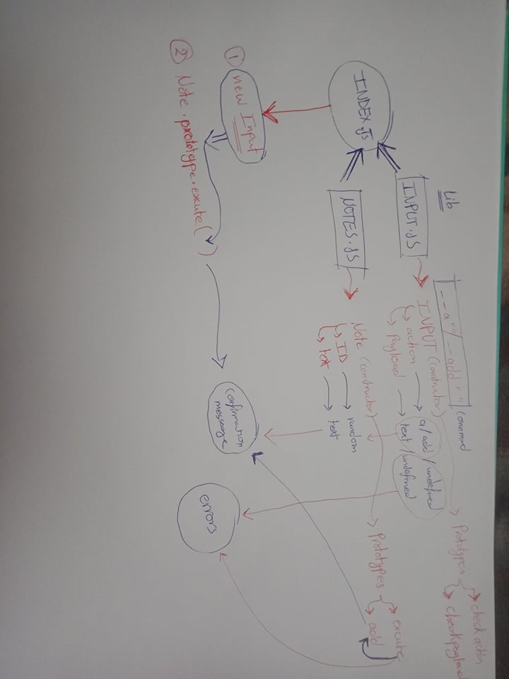

# LAB - Class 01

## Project: Notesy

### Author: Diana Alazzam

### Links and Resources

- [submission PR](https://github.com/diana96alazzam-401-advanced-javascript/notes/pull/1)
- [ci/cd](http://xyz.com) (GitHub Actions)
- [back-end server url](http://xyz.com) (when applicable)
- [front-end application](http://xyz.com) (when applicable)

### Setup

#### `.env` requirements (where applicable)

i.e.

- `PORT` - Port Number
- `MONGODB_URI` - URL to the running mongo instance/db

#### How to initialize/run your application (where applicable)

- `node index.js -a 'add a note here'` or `node index.js --add 'add a note here'`

#### How to use your library (where applicable)

#### Tests

- `npm run lint`
- `npm test`

#### UML

- 
